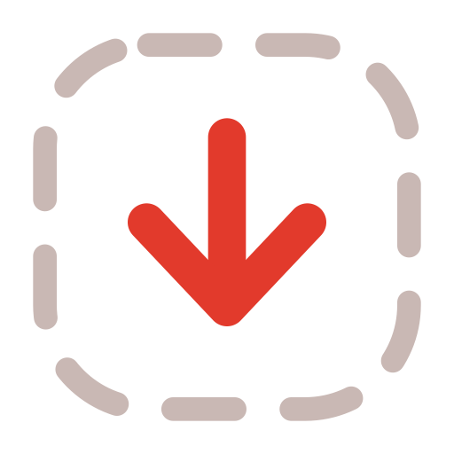
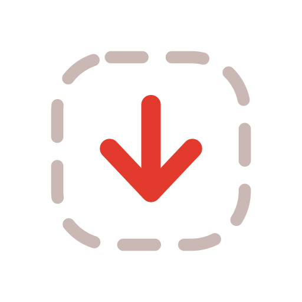
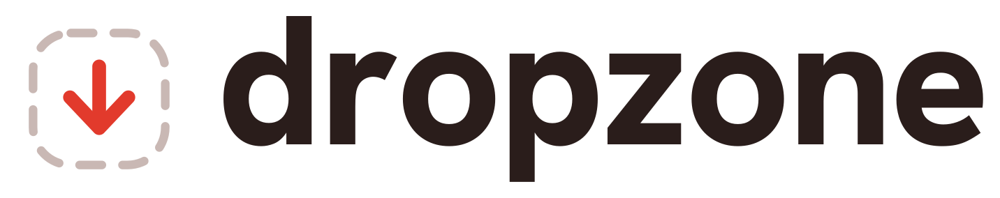
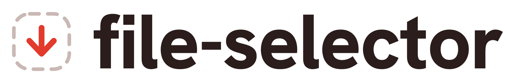

# dropzone — Brand and Logo

The visual identity shared by **[react-dropzone]** and **[file-selector]**. One mark, one
palette, one wordmark family — so the two libraries read as siblings wherever they appear
(npm, GitHub, docs, READMEs, talks).

This repo (`react-dropzone/.github`) is the **canonical home**. Everything here is the
source of truth; consuming repos reference it rather than fork it (see
[§9](#9-using-these-assets-in-a-project)). If a rendered asset and this spec disagree, the
spec wins — regenerate (see [§8](#8-regenerating-assets)).

[react-dropzone]: https://github.com/react-dropzone/react-dropzone
[file-selector]: https://github.com/react-dropzone/file-selector

## Contents

1. [Concept](#1-concept)
2. [The mark](#2-the-mark)
3. [Variants](#3-variants)
4. [Wordmark and lockups](#4-wordmark-and-lockups)
5. [Color](#5-color)
6. [Clear space and minimum sizes](#6-clear-space-and-minimum-sizes)
7. [Usage — do and don't](#7-usage--do-and-dont)
8. [Regenerating assets](#8-regenerating-assets)
9. [Using these assets in a project](#9-using-these-assets-in-a-project)

## 1. Concept

Every file-upload UI on the web renders the same thing: a **dashed rounded rectangle** that
says _"drop files here."_ It's the universal UI convention for the whole category — yet the
well-known libraries in the space brand themselves with mascots or wordmarks (Uppy's dog
mascot, Dropzone.js's wordmark), not the zone itself. Drawing the mark straight from that
convention makes it instantly legible here.

So the mark is exactly that: **a file arriving inside a dashed drop zone.**

- The **dashed square** is the _zone_ — the target, the selection boundary.
- The **downward arrow** is the _drop_ — a file landing in it.

It reads as both meanings the two libraries need:

| Library            | What it does                             | What the mark says               |
| ------------------ | ---------------------------------------- | -------------------------------- |
| **react-dropzone** | drag-and-drop upload zone                | arrow _dropping_ into the zone   |
| **file-selector**  | turns drops / inputs into `File` objects | the zone as a _selection target_ |

The metaphor is literal, it is legible at 16 px, and it carries the project's original
crimson heritage forward (see [§5](#5-color)).

## 2. The mark



Constructed on a **96 × 96 grid**. Everything derives from it, so the mark scales to any
size without redrawing. The canonical geometry lives in
[`lib/mark.mjs`](./lib/mark.mjs) — edit it there, never in a rendered file.

| Element        | Spec                                                               |
| -------------- | ------------------------------------------------------------------ |
| Grid / viewBox | `0 0 96 96`                                                        |
| Zone           | rounded rect, inset **9.5**, size **77 × 77**, corner radius **22** |
| Zone stroke    | **5**, round cap, dash **`13 12`**, color _Zone grey_              |
| Arrow          | shaft `M48 29 V62`, head `M31 47 L48 65 L65 47` (centered in zone) |
| Arrow stroke   | **8**, round cap **+** round join, color _Vermilion_              |

The full source — this is the canonical mark, copy it verbatim:

```svg
<svg xmlns="http://www.w3.org/2000/svg" viewBox="0 0 96 96" fill="none" role="img" aria-label="dropzone">
  <rect x="9.5" y="9.5" width="77" height="77" rx="22" fill="none"
        stroke="#C9B8B4" stroke-width="5" stroke-linecap="round" stroke-dasharray="13 12"/>
  <g stroke="#E23A2C" stroke-width="8" stroke-linecap="round" stroke-linejoin="round">
    <path d="M48 29 V62"/>
    <path d="M31 47 L48 65 L65 47"/>
  </g>
</svg>
```

**Stroke system.** All strokes use round caps and joins. The arrow is always heavier than
the zone (ratio ~1.6 : 1) so the "drop" stays the focal point. Never fill the arrow or the
zone.

## 3. Variants

| Preview                  | Variant          | File                          | Use it for                                                                                                         |
| ------------------------ | ---------------- | ----------------------------- | ------------------------------------------------------------------------------------------------------------------ |
|    | **Primary**      | `logo.svg`                    | default everywhere; transparent background                                                                         |
|  | **Avatar**       | `avatar.svg`                  | GitHub org / npm avatar; extra padding survives a circular crop                                                    |
| —                        | **Favicon**      | `favicon.svg` · `favicon.ico` | browser tab; crop is tightened and strokes bumped for 16 px                                                        |
| —                        | **Monochrome**   | `logo-mono.svg`               | one-color contexts; inherits `currentColor`                                                                        |
|    | **Tile** _(alt)_ | `tile.svg`                    | filled gradient app-icon; use **only** where the outline reads too faintly (tiny favicons, busy/dark social cards) |

The **outline** treatment is primary and preferred — the transparent mark is the identity.
The filled **Tile** exists as a fallback for legibility-critical placements, not as an equal
alternative. Don't mix the two in the same surface.

> **Small-size note.** The outline favicon is crisp at 32 px (retina tabs); its dashes soften
> at 16 px. That's the accepted cost of a consistent outline identity. If a tab needs more
> punch, point `iconUrl` at a Tile-based favicon instead.

## 4. Wordmark and lockups





- **Typeface:** [Hanken Grotesk] **ExtraBold (800)** — open source (SIL OFL 1.1), so it's
  free to ship and embed.
- **Case:** always lowercase.
- **Tracking:** −1.5 %.
- **Color:** the _wordmark_ is a single neutral (Ink on light, Paper on dark); the _mark_
  carries the Vermilion. Don't tint the letters.
- **Lockup spacing** (on the 96-grid mark): mark height **118**, gap to text **30**, outer
  padding **12**. The word is vertically centered on the mark's optical center.

**The letters are outlined to vector paths** in every lockup file — there is no live text and
therefore **no font dependency** anywhere the SVG is used (GitHub, npm, a slide, a foreign
machine). To edit the words or spacing, regenerate (see [§8](#8-regenerating-assets)).

Lockup files: `dropzone-lockup.svg` / `-dark.svg`, `fileselector-lockup.svg` / `-dark.svg`,
and `wordmark.svg` (the word alone, recolorable via `currentColor`).

[Hanken Grotesk]: https://fonts.google.com/specimen/Hanken+Grotesk/about

## 5. Color

| Role           | Name                | Light                 | Dark                  |
| -------------- | ------------------- | --------------------- | --------------------- |
| Accent (arrow) | **Vermilion**       | `#E23A2C`             | `#F0574A`             |
| Accent, deep   | **Deep crimson**    | `#B01B22`             | `#B01B22`             |
| Tile gradient  | **Coral → Crimson** | `#F4604E` → `#C11B26` | `#FF6B57` → `#D0201F` |
| Zone (dashes)  | **Zone grey**       | `#C9B8B4`             | `#5C4741`             |
| Text / ink     | **Ink**             | `#2A1D1B`             | —                     |
| Text on dark   | **Paper**           | —                     | `#F6EEEB`             |
| Surface        | **Warm paper**      | `#FBF6F4`             | `#17110F`             |

**Heritage.** The original logo was crimson `#D0021B`. The new **Vermilion `#E23A2C`** is
that same red warmed ~8° and lifted in value — recognizably the brand, but friendlier and
still vivid on dark grounds. The neutrals are deliberately warm (red-biased), not pure grey,
so the palette feels like one family.

Use exactly one accent. The gradient is reserved for the filled Tile; everything else is flat
Vermilion. All hexes are defined once in [`lib/mark.mjs`](./lib/mark.mjs).

## 6. Clear space and minimum sizes

- **Clear space:** keep free space of at least **½ the arrow's width** on all sides of the
  mark; for lockups, at least the **cap-height of the wordmark**.
- **Minimum size:** mark **16 px** (favicon-verified). Lockups: don't render the wordmark
  below **14 px** cap-height — drop to the mark alone instead.
- On backgrounds busier than a flat color, place the mark on a plain chip or use the Tile.

## 7. Usage — do and don't

**Do**

- Use the provided SVGs; they're resolution-independent.
- Recolor via the documented tokens only.
- Keep the arrow heavier than the zone.

**Don't**

- Fill the outline arrow or zone.
- Recolor the arrow anything but Vermilion (or Paper/Ink inside the Tile).
- Tint, gradient, or shadow the wordmark letters.
- Rotate, skew, or re-space the mark; don't change the dash pattern.
- Set the wordmark in a different typeface or weight.
- Reintroduce the old drop-shadow ellipse from the previous logo.

## 8. Regenerating assets

Everything in [`assets/`](./assets) is generated from [`lib/mark.mjs`](./lib/mark.mjs) (the
geometry + palette) and Hanken Grotesk. Rasterization uses `sharp`, so this runs anywhere,
including CI — no platform tooling required.

```bash
cd brand
npm install
npm run build      # regenerates every SVG, PNG, and favicon.ico in assets/
```

To change the mark, edit `lib/mark.mjs` and rebuild — never hand-edit a file in `assets/`.
The generator produces the marks, both libraries' lockups, and the favicon in one pass.

## 9. Using these assets in a project

Both libraries live under the [`react-dropzone`](https://github.com/react-dropzone) org, so
the identity is an _org_ concern. The rule of thumb: **raw URL for display, local copy for
builds.**

| Need                                           | Approach                                                                                                                                                                              |
| ---------------------------------------------- | ----------------------------------------------------------------------------------------------------------------------------------------------------------------------------------- |
| **These guidelines**                           | Live **once**, here. Other repos link to this page — never copy the prose.                                                                                                          |
| **Logo shown in a README**                     | Reference this repo's **raw URL** — zero duplication, e.g. `https://raw.githubusercontent.com/react-dropzone/.github/main/brand/assets/logo.png`.                                    |
| **Assets a build needs** (docs `public/`, favicon) | Keep a **local copy** of just those few files in the consuming repo. Build tools want local paths and you don't want a network fetch at build time. Sync them with the helper below. |

**Sync helper.** [`sync.mjs`](./sync.mjs) copies the right subset into a sibling repo's
`public/` folder:

```bash
cd brand
node sync.mjs react-dropzone     # → ../../react-dropzone/public
node sync.mjs file-selector      # → ../../file-selector/public
```

Each consumer gets the shared favicon plus its own lockup:

- **react-dropzone** → `favicon.svg`, `favicon.ico`, `dropzone-lockup.svg`, `dropzone-lockup-dark.svg`
- **file-selector** → `favicon.svg`, `favicon.ico`, `fileselector-lockup.svg`, `fileselector-lockup-dark.svg`

Then wire them in the docs config (`iconUrl` + a theme-aware `logoUrl`) — see
react-dropzone's `vocs.config.ts` for the pattern. Avoid git submodules; a copy of a handful
of stable SVGs is lower-friction than the alternative.
